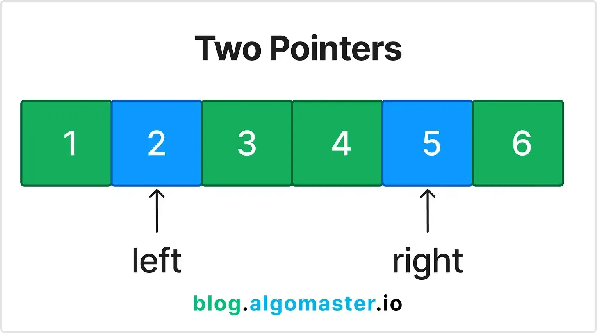
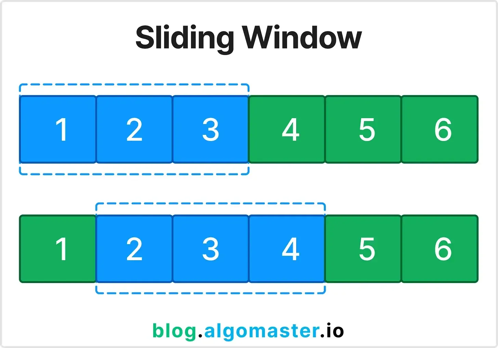
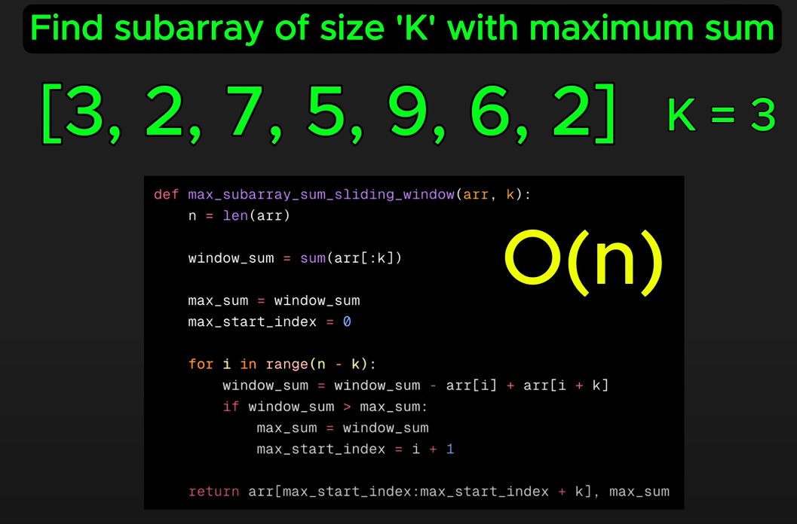
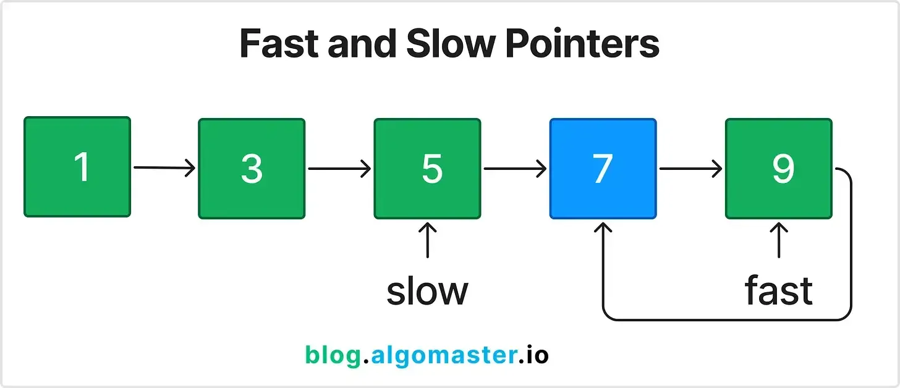

# [LeetCode Patterns to Master Coding Interview Questions](https://blog.algomaster.io/p/15-leetcode-patterns)

## 1. Prefix Sum

- **Description of the pattern:**
  - Useful: When you need to calculate the sum of subarrays multiple times or need to calculate cumulative sums.
  - Prefix Sum involves preprocessing an array to create a new array where each element at index i represents the sum of the array from the start-up to i. This allows for efficient sum queries on subarrays.
  - Tip: You don't always need to have a new array to store the prefix sum. You can also use the same array to store the prefix sum. (array[i] = array[i] + array[i-1])

  
  

- **Sample Problem:** Given an array nums, answer multiple queries about the sum of elements within a specific range [i, j].
  - **Input:** nums = [1, 2, 3, 4, 5, 6], i = 1, j = 3
  - **Output:** 9
- **Explanation:**
  - Preprocess the array A to create a prefix sum array: P = [1, 3, 6, 10, 15, 21].
  - To find the sum between indices i and j, use the formula: P[j] - P[i-1].
- **LeetCode Problems:**
  - [Range Sum Query — Immutable {LeetCode#303}](https://leetcode.com/problems/range-sum-query-immutable/)
  - [Contiguous Array {LeetCode#525}](https://leetcode.com/problems/contiguous-array/)
  - [Subarray Sum Equals K {LeetCode#560}](https://leetcode.com/problems/subarray-sum-equals-k/)

## 2. Two Pointers

- **Description of the pattern:**
  - Useful: When dealing with sorted arrays or lists where you need to find pairs that satisfy a specific condition.
  - The Two Pointers pattern involves using two pointers to iterate through an array or list, often used to find pairs or elements that meet specific criteria.
  - Tip: The pointers can move in the same direction or in opposite directions. Also, they can start from the same end or opposite ends, depending on the problem.

  

- **Sample Problem:** Find two numbers in a sorted array that add up to a target value.
  - **Input:** nums = [1, 2, 3, 4, 6], target = 6
  - **Output:** [1, 3]
- **Explanation:**
  - Initialize two pointers, one at the start (left) and one at the end (right) of the array.
  - Check the sum of the elements at the two pointers.
  - If the sum equals the target, return the indices.
  - If the sum is less than the target, move the left pointer to the right.
  - If the sum is greater than the target, move the right pointer to the left.
- **LeetCode Problems:**
  - [Two Sum II {LeetCode#167}](https://leetcode.com/problems/two-sum-ii-input-array-is-sorted/)
  - [3Sum {LeetCode#15}](https://leetcode.com/problems/3sum/)
  - [Container With Most Water {LeetCode#11}](https://leetcode.com/problems/container-with-most-water/)

## 3. Sliding Window

- **Description of the pattern:**
  - Useful: When dealing with problems involving contiguous subarrays or substrings.
  - The Sliding Window pattern is used to find a subarray or substring that satisfies a specific condition, optimizing the time complexity by maintaining a window of elements.
  - Tip: The window can slide in one direction or two directions, depending on the problem.

  
  

- **Sample Problem:** Given an array of integers, find the maximum sum of a subarray of size k.
  - **Input:** [2, 1, 5, 1, 3, 2], k = 3
  - **Output:** 9
- **Explanation:**
  - Start with the sum of the first k elements.
  - Slide the window one element at a time, subtracting the element that goes out of the window and adding the new element.
  - Keep track of the maximum sum encountered.
- **LeetCode Problems:**
  - [Maximum Average Subarray I {LeetCode#643}](https://leetcode.com/problems/maximum-average-subarray-i/)
  - [Longest Substring Without Repeating Characters {LeetCode#3}](https://leetcode.com/problems/longest-substring-without-repeating-characters/)
  - [Minimum Window Substring {LeetCode#76}](https://leetcode.com/problems/minimum-window-substring/)

## 4. Fast & Slow Pointers (Tortoise and Hare)

- **Description of the pattern:**
  - Useful: To detect cycles in linked lists or find the middle of the linked list and other similar structures.
  - Moving two pointers at different speeds.
  - Tip: The fast pointer moves two steps at a time, while the slow pointer moves one step at a time.

  

- **Explanation:**
  - Initialize two pointers, one moving one step at a time (slow) and the other moving two steps at a time (fast).
  - If there is a cycle, the fast pointer will eventually meet the slow pointer.
  - If the fast pointer reaches the end of the list, there is no cycle.
- **LeetCode Problems:**
  - [Linked List Cycle {LeetCode#141}](https://leetcode.com/problems/linked-list-cycle/)
  - [Happy Number {LeetCode#202}](https://leetcode.com/problems/happy-number/)
  - [Find the Duplicate Number {LeetCode#287}](https://leetcode.com/problems/find-the-duplicate-number/)

## 5. Linked List In-place Reversal

- **Description of the pattern:**
  - Useful: When 
  - 
  - Tip: 

  

- **Sample Problem:** Given 
  - **Input:** 
  - **Output:** 
- **Explanation:**
  - 
  - 
- **LeetCode Problems:**
  - [ {LeetCode#}]()
  - [ {LeetCode#}]()
  - [ {LeetCode#}]()

## 6. Monotonic Stack

- **Description of the pattern:**
  - Useful: When 
  - 
  - Tip: 

  

- **Sample Problem:** Given 
  - **Input:** 
  - **Output:** 
- **Explanation:**
  - 
  - 
- **LeetCode Problems:**
  - [ {LeetCode#}]()
  - [ {LeetCode#}]()
  - [ {LeetCode#}]()

## 7. Top 'K' Elements

- **Description of the pattern:**
  - Useful: When 
  - 
  - Tip: 

  

- **Sample Problem:** Given 
  - **Input:** 
  - **Output:** 
- **Explanation:**
  - 
  - 
- **LeetCode Problems:**
  - [ {LeetCode#}]()
  - [ {LeetCode#}]()
  - [ {LeetCode#}]()

## 8. Overlapping Intervals

- **Description of the pattern:**
  - Useful: When 
  - 
  - Tip: 

  

- **Sample Problem:** Given 
  - **Input:** 
  - **Output:** 
- **Explanation:**
  - 
  - 
- **LeetCode Problems:**
  - [ {LeetCode#}]()
  - [ {LeetCode#}]()
  - [ {LeetCode#}]()

## 9. Modified Binary Search

- **Description of the pattern:**
  - Useful: When 
  - 
  - Tip: 

  

- **Sample Problem:** Given 
  - **Input:** 
  - **Output:** 
- **Explanation:**
  - 
  - 
- **LeetCode Problems:**
  - [ {LeetCode#}]()
  - [ {LeetCode#}]()
  - [ {LeetCode#}]()

## 10. Binary Tree Traversal

- **Description of the pattern:**
  - Useful: When 
  - 
  - Tip: 

  

- **Sample Problem:** Given 
  - **Input:** 
  - **Output:** 
- **Explanation:**
  - 
  - 
- **LeetCode Problems:**
  - [ {LeetCode#}]()
  - [ {LeetCode#}]()
  - [ {LeetCode#}]()

## 11. Depth First Search (DFS)

- **Description of the pattern:**
  - Useful: When 
  - 
  - Tip: 

  

- **Sample Problem:** Given 
  - **Input:** 
  - **Output:** 
- **Explanation:**
  - 
  - 
- **LeetCode Problems:**
  - [ {LeetCode#}]()
  - [ {LeetCode#}]()
  - [ {LeetCode#}]()

## 12. Breadth First Search (BFS)

- **Description of the pattern:**
  - Useful: When 
  - 
  - Tip: 

  

- **Sample Problem:** Given 
  - **Input:** 
  - **Output:** 
- **Explanation:**
  - 
  - 
- **LeetCode Problems:**
  - [ {LeetCode#}]()
  - [ {LeetCode#}]()
  - [ {LeetCode#}]()

## 13. Matrix Traversal

- **Description of the pattern:**
  - Useful: When 
  - 
  - Tip: 

  

- **Sample Problem:** Given 
  - **Input:** 
  - **Output:** 
- **Explanation:**
  - 
  - 
- **LeetCode Problems:**
  - [ {LeetCode#}]()
  - [ {LeetCode#}]()
  - [ {LeetCode#}]()

## 14. Backtracking

- **Description of the pattern:**
  - Useful: When 
  - 
  - Tip: 

  

- **Sample Problem:** Given 
  - **Input:** 
  - **Output:** 
- **Explanation:**
  - 
  - 
- **LeetCode Problems:**
  - [ {LeetCode#}]()
  - [ {LeetCode#}]()
  - [ {LeetCode#}]()

## 15. Dynamic Programming Patterns

- **Description of the pattern:**
  - Useful: When
  -
  - Tip:

  

- **Sample Problem:** Given
  - **Input:**
  - **Output:**
- **Explanation:**
  -
- **LeetCode Problems:**
  - [Climbing Stairs {LeetCode#70}](https://leetcode.com/problems/climbing-stairs/)
  - [House Robber {LeetCode#198}](https://leetcode.com/problems/house-robber/)
  - [Coin Change {LeetCode#322}](https://leetcode.com/problems/coin-change/)
  - [Longest Common Subsequence {LeetCode#1143}](https://leetcode.com/problems/longest-common-subsequence/)
  - [Longest Increasing Subsequence {LeetCode#300}](https://leetcode.com/problems/longest-increasing-subsequence/)
  - [Partition Equal Subset Sum {LeetCode#416}](https://leetcode.com/problems/partition-equal-subset-sum/)

## 16. Merge Intervals

- **Description of the pattern:**
  - Useful: When
  -
  - Tip:

  

- **Sample Problem:** Given
  - **Input:**
  - **Output:**
- **Explanation:**
  -
- **LeetCode Problems:**
  - [ {LeetCode#}]()
  - [ {LeetCode#}]()
  - [ {LeetCode#}]()