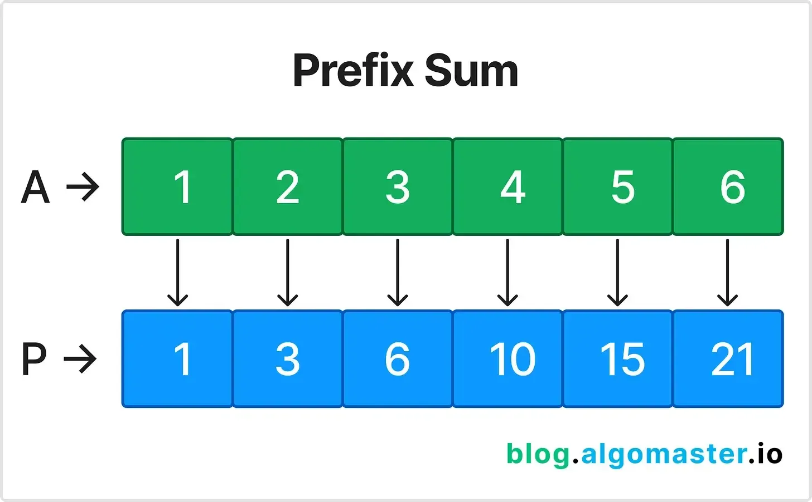
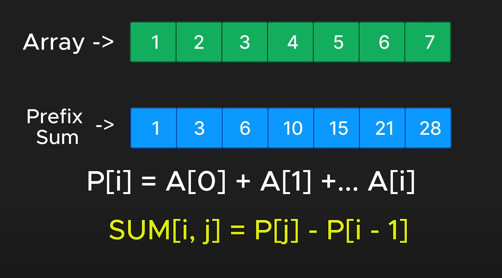

# [15 LeetCode Patterns to Master Coding Interview Questions](https://blog.algomaster.io/p/15-leetcode-patterns)

---

## 1. Prefix Sum

- **Description of the pattern:**
    - Useful: When you need to calculate the sum of subarrays multiple times or need to calculate cumulative sums.
    - Prefix Sum involves preprocessing an array to create a new array where each element at index i represents the sum of the array from the start-up to i. This allows for efficient sum queries on subarrays.
    - Tip: You don't always need to have a new array to store the prefix sum. You can also use the same array to store the prefix sum. (array[i] = array[i] + array[i-1])

- **Sample Problem:** Given an array nums, answer multiple queries about the sum of elements within a specific
  range [i, j].
    - **Input:** nums = [1, 2, 3, 4, 5, 6], i = 1, j = 3
    - **Output:** 9
- **Explanation:**
  - Preprocess the array A to create a prefix sum array: P = [1, 3, 6, 10, 15, 21].
  - To find the sum between indices i and j, use the formula: P[j] - P[i-1].
- **LeetCode Problems:**
    - [Range Sum Query — Immutable {LeetCode#303}](https://leetcode.com/problems/range-sum-query-immutable/)
    - [Contiguous Array {LeetCode#525}](https://leetcode.com/problems/contiguous-array/)
    - [Subarray Sum Equals K {LeetCode#560}](https://leetcode.com/problems/subarray-sum-equals-k/)

## 2. Two Pointers

- Description of the pattern
- **Sample Problem:**
    - **Input:**
    - **Output:**
- **LeetCode Problems:**
    - [Two Sum II](https://leetcode.com/problems/two-sum-ii-input-array-is-sorted/)
    - [3Sum](https://leetcode.com/problems/3sum/)
    - [Container With Most Water](https://leetcode.com/problems/container-with-most-water/)

## 3. Sliding Window

- Description of the pattern
- **Sample Problem:**
    - **Input:**
    - **Output:**
- **LeetCode Problems:**
    - [Maximum Average Subarray I](https://leetcode.com/problems/maximum-average-subarray-i/)
    - [Longest Substring Without Repeating Characters](https://leetcode.com/problems/longest-substring-without-repeating-characters/)
    - [Minimum Window Substring](https://leetcode.com/problems/minimum-window-substring/)

## 4. Fast & Slow Pointers

- Description of the pattern
- **Sample Problem:**
- **LeetCode Problems:**
    - [Linked List Cycle](https://leetcode.com/problems/linked-list-cycle/)
    - [Happy Number](https://leetcode.com/problems/happy-number/)
    - [Find the Duplicate Number](https://leetcode.com/problems/find-the-duplicate-number/)

... (Continue with the other patterns)

## 15. Dynamic Programming Patterns

- Description of the pattern
- **Sample Problem:**
- **LeetCode Problems:**
    - [Climbing Stairs](https://leetcode.com/problems/climbing-stairs/)
    - [House Robber](https://leetcode.com/problems/house-robber/)
    - [Coin Change](https://leetcode.com/problems/coin-change/)
    - [Longest Common Subsequence](https://leetcode.com/problems/longest-common-subsequence/)
    - [Longest Increasing Subsequence](https://leetcode.com/problems/longest-increasing-subsequence/)
    - [Partition Equal Subset Sum](https://leetcode.com/problems/partition-equal-subset-sum/)

---
