# [LeetCode Patterns to Master Coding Interview Questions](https://www.youtube.com/watch?v=DjYZk8nrXVY)

## 1. Prefix Sum

- **Description of the pattern:**
  - Useful: When you need to calculate the sum of subarrays multiple times or need to calculate cumulative sums.
  - Prefix Sum involves preprocessing an array to create a new array where each element at index i represents the sum of the array from the start-up to i. This allows for efficient sum queries on subarrays.
  - Tip: You don't always need to have a new array to store the prefix sum. You can also use the same array to store the prefix sum. (array[i] = array[i] + array[i-1])

  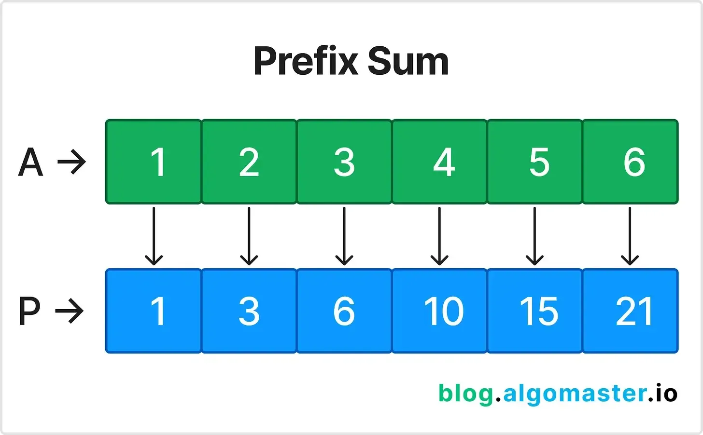
  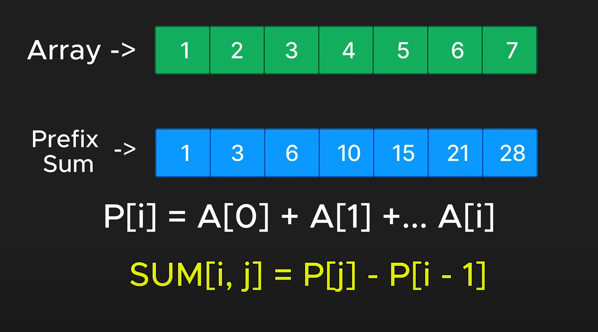

- **Sample Problem:** Given an array nums, answer multiple queries about the sum of elements within a specific range [i, j].
  - **Input:** nums = [1, 2, 3, 4, 5, 6], i = 1, j = 3
  - **Output:** 9
- **Explanation:**
  1. Preprocess the array A to create a prefix sum array: P = [1, 3, 6, 10, 15, 21].
  2. To find the sum between indices i and j, use the formula: P[j] - P[i-1].
- **LeetCode Problems:**
  - [Range Sum Query — Immutable {LeetCode#303}](https://leetcode.com/problems/range-sum-query-immutable/)
  - [Contiguous Array {LeetCode#525}](https://leetcode.com/problems/contiguous-array/)
  - [Subarray Sum Equals K {LeetCode#560}](https://leetcode.com/problems/subarray-sum-equals-k/)

## 2. Two Pointers

- **Description of the pattern:**
  - Useful: When dealing with sorted arrays or lists where you need to find pairs that satisfy a specific condition.
  - The Two Pointers pattern involves using two pointers to iterate through an array or list, often used to find pairs or elements that meet specific criteria.
  - Tip: The pointers can move in the same direction or in opposite directions. Also, they can start from the same end or opposite ends, depending on the problem.

  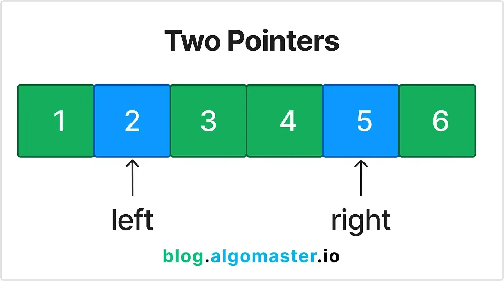

- **Sample Problem:** Find two numbers in a sorted array that add up to a target value.
  - **Input:** nums = [1, 2, 3, 4, 6], target = 6
  - **Output:** [1, 3]
- **Explanation:**
  - Initialize two pointers, one at the start (left) and one at the end (right) of the array.
  1. Check the sum of the elements at the two pointers.
  2. If the sum equals the target, return the indices.
  3. If the sum is less than the target, move the left pointer to the right.
  4. If the sum is greater than the target, move the right pointer to the left.
- **LeetCode Problems:**
  - [Two Sum II {LeetCode#167}](https://leetcode.com/problems/two-sum-ii-input-array-is-sorted/)
  - [3Sum {LeetCode#15}](https://leetcode.com/problems/3sum/)
  - [Container With Most Water {LeetCode#11}](https://leetcode.com/problems/container-with-most-water/)

## 3. Sliding Window

- **Description of the pattern:**
  - Useful: When dealing with problems involving contiguous subarrays or substrings.
  - The Sliding Window pattern is used to find a subarray or substring that satisfies a specific condition, optimizing the time complexity by maintaining a window of elements.
  - Tip: The window can slide in one direction or two directions, depending on the problem.

  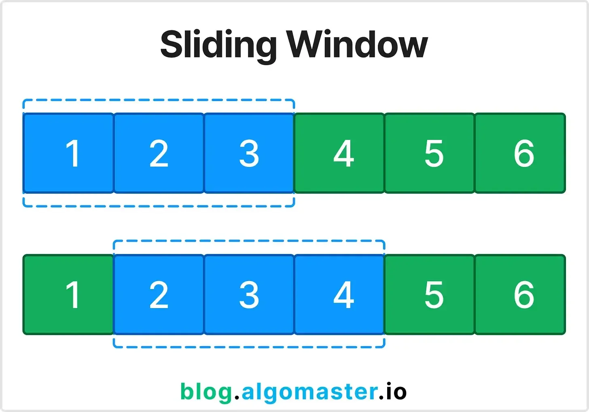
  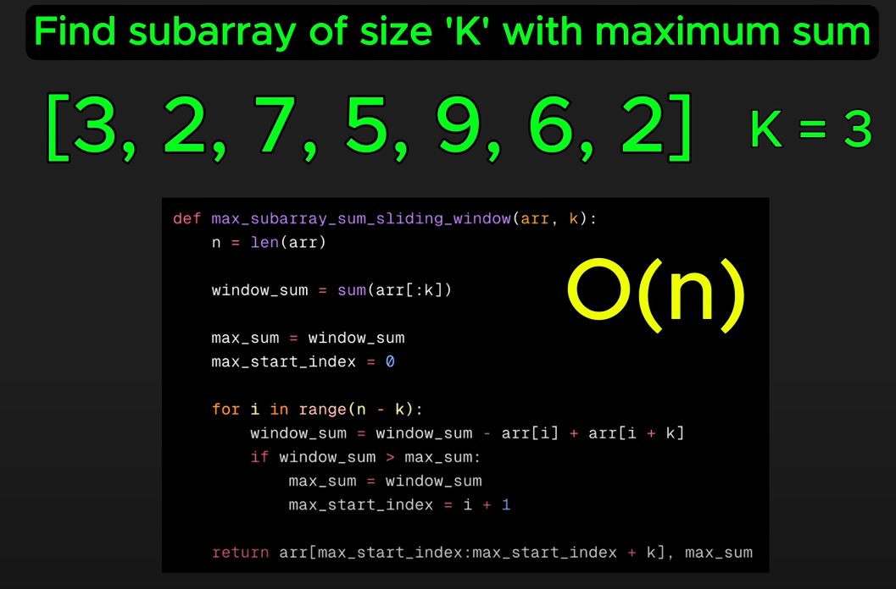

- **Sample Problem:** Given an array of integers, find the maximum sum of a subarray of size k.
  - **Input:** [2, 1, 5, 1, 3, 2], k = 3
  - **Output:** 9
- **Explanation:**
  1. Start with the sum of the first k elements.
  2. Slide the window one element at a time, subtracting the element that goes out of the window and adding the new element.
  3. Keep track of the maximum sum encountered.
- **LeetCode Problems:**
  - [Maximum Average Subarray I {LeetCode#643}](https://leetcode.com/problems/maximum-average-subarray-i/)
  - [Longest Substring Without Repeating Characters {LeetCode#3}](https://leetcode.com/problems/longest-substring-without-repeating-characters/)
  - [Minimum Window Substring {LeetCode#76}](https://leetcode.com/problems/minimum-window-substring/)

## 4. Fast & Slow Pointers (Tortoise and Hare)

- **Description of the pattern:**
  - Useful: To detect cycles in linked lists or find the middle of the linked list and other similar structures.
  - Moving two pointers at different speeds.
  - Tip: The fast pointer moves two steps at a time, while the slow pointer moves one step at a time.

  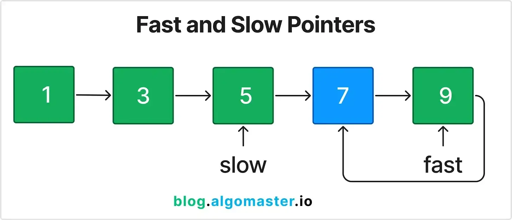

- **Explanation:**
  1. Initialize two pointers, one moving one step at a time (slow) and the other moving two steps at a time (fast).
  2. If there is a cycle, the fast pointer will eventually meet the slow pointer.
  3. If the fast pointer reaches the end of the list, there is no cycle.
- **LeetCode Problems:**
  - [Linked List Cycle {LeetCode#141}](https://leetcode.com/problems/linked-list-cycle/)
  - [Happy Number {LeetCode#202}](https://leetcode.com/problems/happy-number/)
  - [Find the Duplicate Number {LeetCode#287}](https://leetcode.com/problems/find-the-duplicate-number/)

## 5. Linked List In-place Reversal

- **Description of the pattern:** We could use an extra array or stack to reverse the linked list, but the in-place reversal is more efficient.
  - Useful: When you need to reverse a full or a part of the linked list.
  - Tip: The in-place reversal involves changing the next pointer of each node to point to the previous node.

  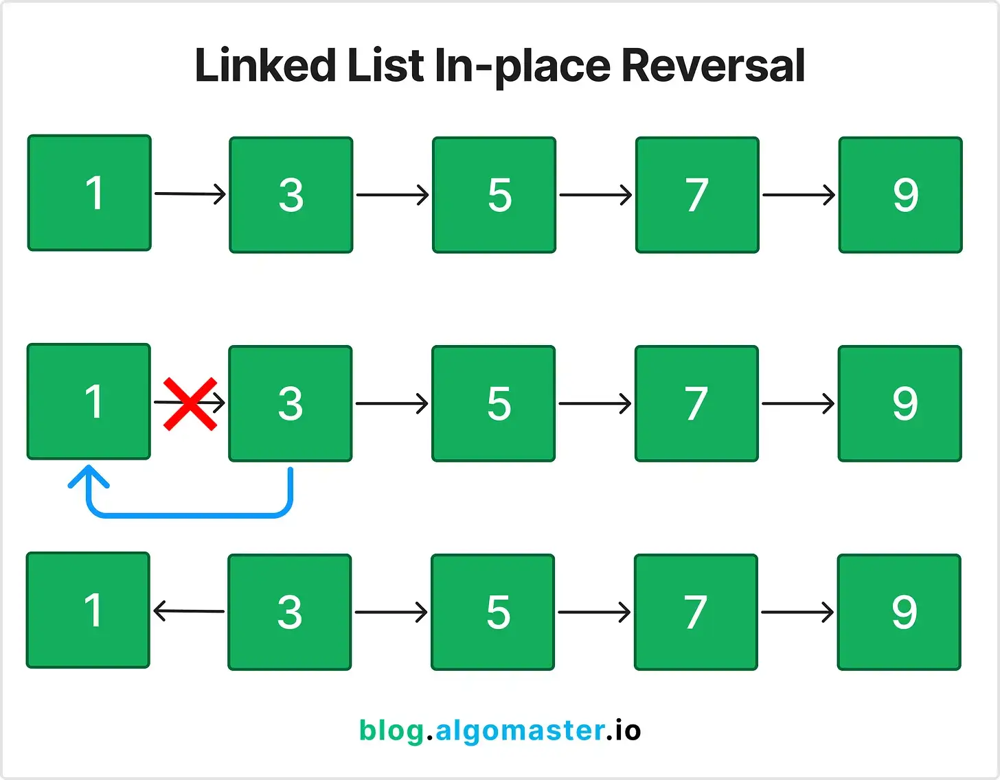
  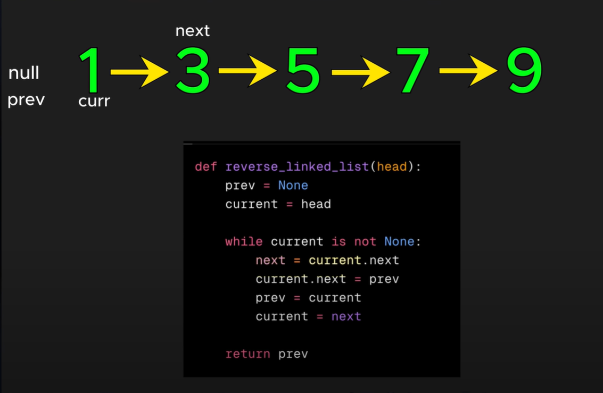
  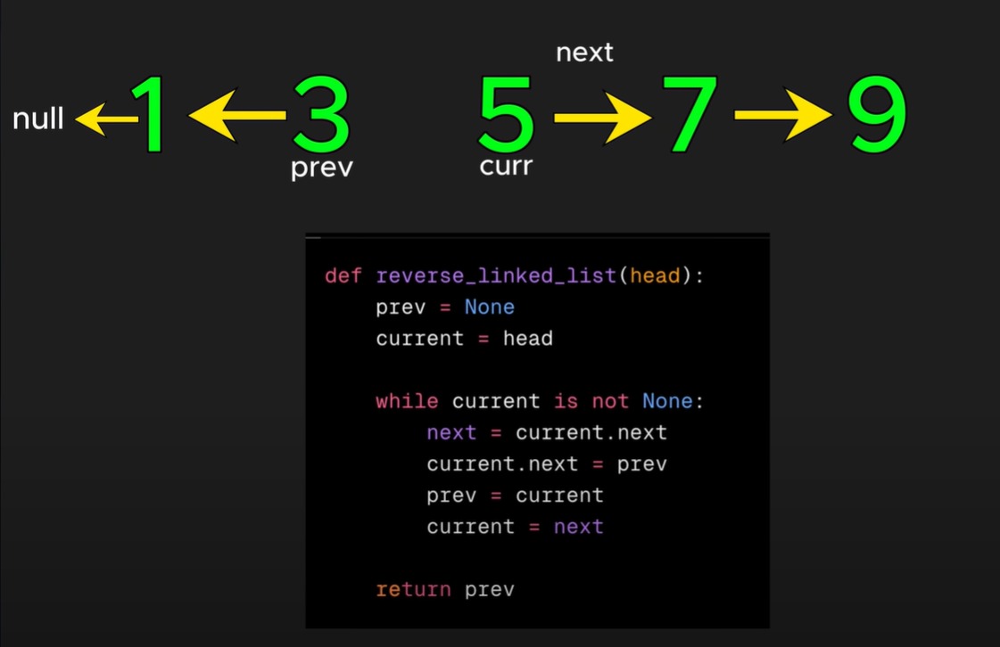
  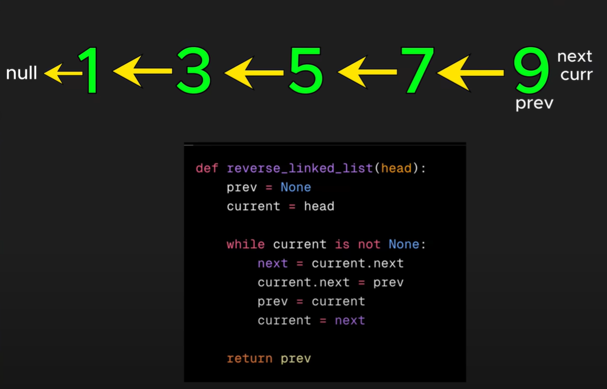

- **Sample Problem:** Given a linked list, reverse a sublist of a linked list from position m to n.
  - **Input:** head = [1, 2, 3, 4, 5], m = 2, n = 4
  - **Output:** [1, 4, 3, 2, 5]
- **Explanation:**
  1. Identify the start and end of the sublist.
  2. Reverse the nodes in place by adjusting the pointers.
- **LeetCode Problems:**
  - [Reverse Linked List {LeetCode#}206](https://leetcode.com/problems/reverse-linked-list/description/)
  - [Reverse Linked List II {LeetCode#92}](https://leetcode.com/problems/reverse-linked-list-ii/description/)
  - [Swap Nodes in Pairs {LeetCode#24}](https://leetcode.com/problems/swap-nodes-in-pairs/description/)

## 6. Monotonic Stack

- **Description of the pattern:**
  - Useful: When we require finding the next greater or smaller element for each element in an array (the array could be linear or circular).
  - This pattern uses a stack to maintain a sequence of elements in a specific order (increasing or decreasing).
  - Tip: The stack can be used to keep track of elements for which we haven't found the next greater or smaller element yet.

  
  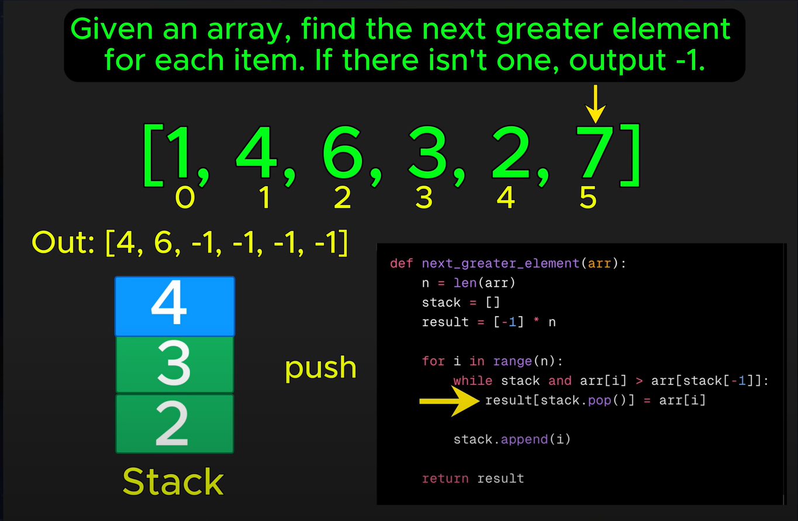

- **Sample Problem:** Find the next greater element for each element in an array. Output -1 if the greater element doesn’t exist.
  - **Input:** nums = [2, 1, 2, 4, 3]
  - **Output:** [4, 2, 4, -1, -1]
- **Explanation:**
  1. Use a stack to keep track of elements for which we haven't found the next greater element yet.
  2. Iterate through the array, and for each element, pop elements from the stack until you find a greater element.
  3. If the stack is not empty, set the result for index at the top of the stack to the current element.
  4. Push the current element onto the stack.
- **LeetCode Problems:**
  - [Next Greater Element I {LeetCode#496}](https://leetcode.com/problems/next-greater-element-i/description/)
  - [Daily Temperatures {LeetCode#739}](https://leetcode.com/problems/daily-temperatures/description/)
  - [Largest Rectangle in Histogram {LeetCode#84}](https://leetcode.com/problems/largest-rectangle-in-histogram/description/)

## 7. Top 'K' Elements

- **Description of the pattern:**
  - Useful: When we need to find the top kth largest or smallest elements in an array or stream of data using heaps or sorting.
  - This pattern involves using a heap to maintain the top k elements of an array or stream of data.
  - Tip: If you need the top **kth smallest element**, use a **max-heap**. If you need the **top kth largest element**, use a **min-heap**.

  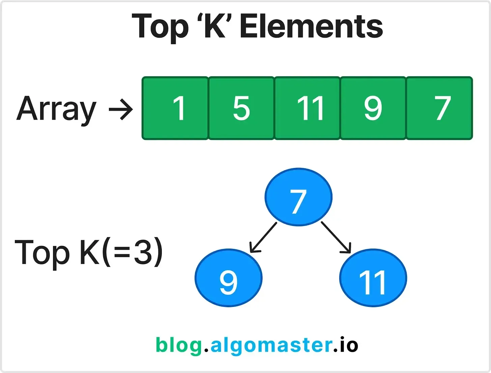
  

- **Sample Problem:** Given an array, find the k-th largest element in an unsorted array.
  - **Input:** nums = [3, 2, 1, 5, 6, 4], k = 2
  - **Output:** 5
- **Explanation:**
  1. Use a min-heap of size k to keep track of the k largest elements.
  2. Iterate through the array, adding elements to the heap.
  3. If the heap size exceeds k, remove the smallest element from the heap.
  4. The root of the heap will be the k-th largest element.
- **LeetCode Problems:**
  - [Kth Largest Element in an Array {LeetCode#215}](https://leetcode.com/problems/kth-largest-element-in-an-array/description/)
  - [Top K Frequent Elements {LeetCode#347}](https://leetcode.com/problems/top-k-frequent-elements/description/)
  - [Find K Pairs with Smallest Sums {LeetCode#373}](https://leetcode.com/problems/find-k-pairs-with-smallest-sums/description/)

## 8. Overlapping Intervals (Merge Intervals)

- **Description of the pattern:**
  - Useful: When you need to merge overlapping intervals or find the maximum number of overlapping intervals.
  - The Overlapping Intervals pattern is used to merge or handle overlapping intervals in an array.
  - In an interval array sorted by start time, two intervals [a, b] and [c, d] overlap if b >= c (i.e., the end time of the first interval is greater than or equal to the start time of the second interval).
  - Tip: Sort the intervals by start time and then iterate through the intervals to merge or handle overlapping intervals.

  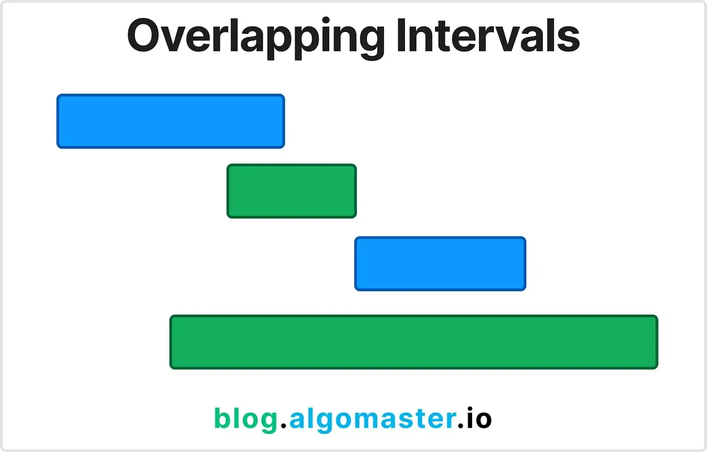

- **Sample Problem:** Given a collection of intervals, merge all overlapping intervals.
  - **Input:** intervals = [[1, 3], [2, 6], [8, 10], [15, 18]]
  - **Output:** [[1, 6], [8, 10], [15, 18]]
- **Explanation:**
  1. Sort the intervals by their start time.
  2. Create an empty list called merged to store the merged intervals.
  3. Iterate through the intervals and check if it overlaps with the last interval in the merged list.
  4. If it overlaps, merge the intervals by updating the end time of the last interval in merged.
  5. If it does not overlap, simply add the current interval to the merged list.
- **LeetCode Problems:**
  - [Merge Intervals {LeetCode#56}](https://leetcode.com/problems/merge-intervals/description/)
  - [Insert Intervals {LeetCode#57}](https://leetcode.com/problems/insert-interval/description/)
  - [Non-Overlapping Intervals {LeetCode#435}](https://leetcode.com/problems/non-overlapping-intervals/description/)

## 9. Modified Binary Search

- **Description of the pattern:**
  - Useful: When we need to find an element in a sorted array or a rotated sorted array.
  - The Modified Binary Search pattern adapts binary search to solve a wider range of problems, such as finding elements in rotated sorted arrays.
  - Tip: The key to solving problems using this pattern is to determine which half of the array is sorted and then decide whether to search that half or the other half.

  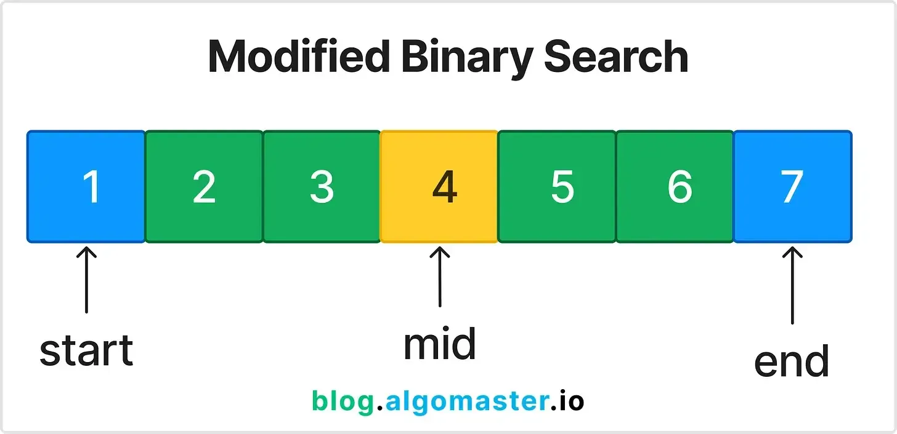

- **Sample Problem:** Given an array, find an element in a rotated sorted array.
  - **Input:** nums = [4, 5, 6, 7, 0, 1, 2], target = 0
  - **Output:** 4
- **Explanation:**
  1. Perform binary search with an additional check to determine which half of the array is sorted.
  2. We then check if the target is within the range of the sorted half.
  3. If it is, we search that half; otherwise, we search the other half.
- **LeetCode Problems:**
  - [Search in Rotated Sorted Array {LeetCode#153}](https://leetcode.com/problems/search-in-rotated-sorted-array/description/)
  - [Find Minimum in Rotated Sorted Array {LeetCode#33}](https://leetcode.com/problems/find-minimum-in-rotated-sorted-array/description/)
  - [Search a 2D Matrix II {LeetCode#240}](https://leetcode.com/problems/search-a-2d-matrix-ii/description/)

## 10. Binary Tree Traversal

- **Description of the pattern:**
  - Useful: When we need to visit all the nodes in a binary tree to get a particular result.
  - Binary Tree Traversal involves visiting all the nodes in a binary tree in a specific order.
  - Tip: There are three types of binary tree traversal: pre-order, in-order, and post-order.
    - Pre-order: root, left, right
    - In-order: left, root, right
    - Post-order: left, right, root

  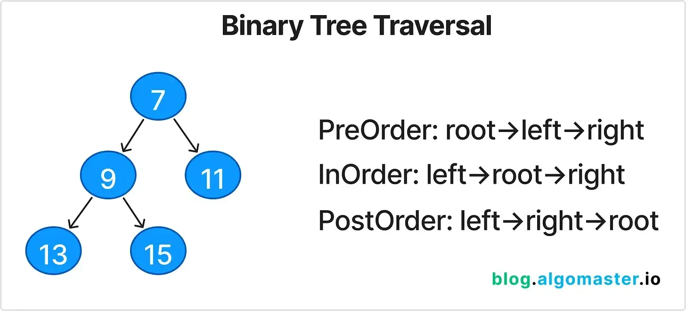

- **Sample Problem:** Perform in-order traversal of a binary tree.
  - **Input:** root = [1, null, 2, 3]
  - **Output:** [1, 3, 2]
- **Explanation:**
  1. In-order traversal visits nodes in the order: left, root, right.
  2. Use recursion or a stack to traverse the tree in this order.
- **LeetCode Problems:**
  - [PreOrder → Binary Tree Paths {LeetCode#257}](https://leetcode.com/problems/binary-tree-paths/description/)
  - [InOrder → Kth Smallest Element in a BST {LeetCode#230}](https://leetcode.com/problems/kth-smallest-element-in-a-bst/description/)
  - [PostOrder → Binary Tree Maximum Path Sum {LeetCode#124}](https://leetcode.com/problems/binary-tree-maximum-path-sum/description/)

## 11. Depth First Search (DFS)

- **Description of the pattern:**
  - Useful: When we need to explore all paths or branches in graphs or trees.
  - Depth-First Search (DFS) is a traversal technique that explores as far down a branch as possible before backtracking.
  - Tip: Use recursion or a stack to traverse each path from the root to the leaves.

  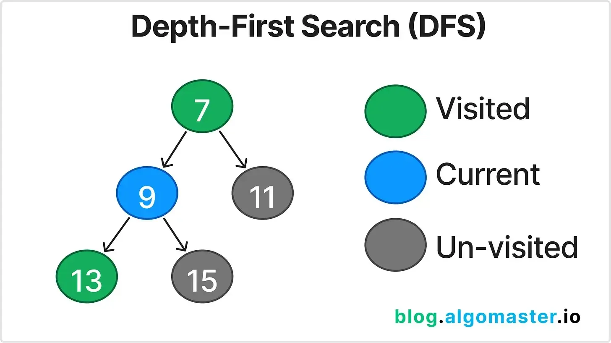

- **Sample Problem:** Find all paths from the root to leaves in a binary tree.
  - **Input:** root = [1, 2, 3, null, 5]
  - **Output:** ["1->2->5", "1->3"]
- **Explanation:**
  1. Use recursion or a stack to traverse each path from the root to the leaves.
  2. Record each path as you traverse.
- **LeetCode Problems:**
  - [Clone Graph {LeetCode#133}](https://leetcode.com/problems/clone-graph/description/)
  - [Path Sum II {LeetCode#113}](https://leetcode.com/problems/path-sum-ii/description/)
  - [Course Schedule II {LeetCode#210}](https://leetcode.com/problems/course-schedule-ii/description/)

## 12. Breadth First Search (BFS)

- **Description of the pattern:**
  - Useful: For finding the shortest paths in unweighted graphs or level-order traversal in trees.
  - Breadth-First Search (BFS) is a traversal technique that explores nodes level by level in a tree or graph.
  - Tip: Use a queue to traverse each level of the tree or graph.

  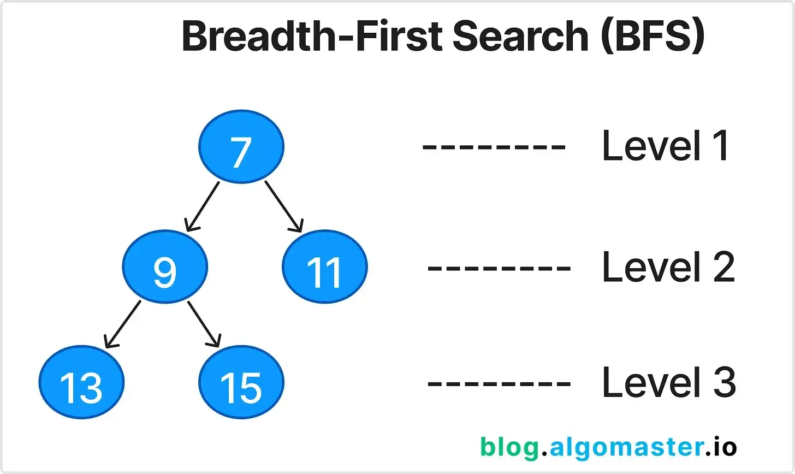

- **Sample Problem:** Perform level-order traversal of a binary tree.
  - **Input:** root = [3, 9, 20, null, null, 15, 7]
  - **Output:** [[3], [9, 20], [15, 7]]
- **Explanation:**
  1. Use a queue to keep track of nodes at each level.
  2. Traverse each level and add the children of the current nodes to the queue.
- **LeetCode Problems:**
  - [Binary Tree Level Order Traversal {LeetCode#102}](https://leetcode.com/problems/binary-tree-level-order-traversal/description/)
  - [Rotting Oranges {LeetCode#994}](https://leetcode.com/problems/rotting-oranges/description/)
  - [Word Ladder {LeetCode#127}](https://leetcode.com/problems/word-ladder/description/)

## 13. Matrix Traversal

- **Description of the pattern:**
  - Useful: When problems involve traversing 2D grids or matrices horizontally, vertically or diagonally.
  - Matrix Traversal involves traversing elements in a matrix using different techniques (DFS, BFS, etc.).
  - Tip: Use DFS or BFS to traverse the matrix starting from a given cell.

  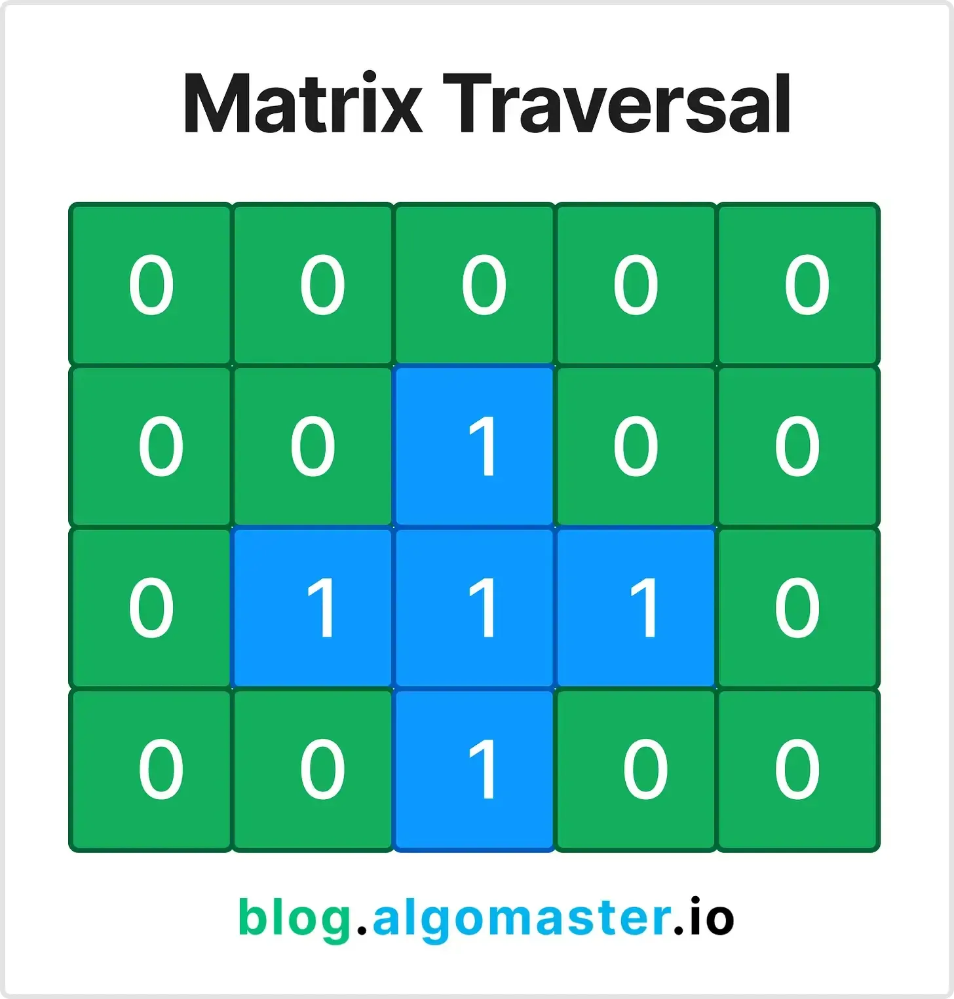

- **Sample Problem:** Perform flood fill on a 2D grid. Change all the cells connected to the starting cell to new color.
  - **Input:** image = [[1,1,1],[1,1,0],[1,0,1]], sr = 1, sc = 1, newColor = 2
  - **Output:** [[2,2,2],[2,2,0],[2,0,1]]
- **Explanation:**
  1. Use DFS or BFS to traverse the matrix starting from the given cell.
  2. Change the color of the connected cells to the new color.
- **LeetCode Problems:**
  - [Flood Fill {LeetCode#733}](https://leetcode.com/problems/flood-fill/description/)
  - [Number of Islands {LeetCode#200}](https://leetcode.com/problems/number-of-islands/description/)
  - [Surrounded Regions {LeetCode#130}](https://leetcode.com/problems/surrounded-regions/description/)

## 14. Backtracking

- **Description of the pattern:**
  - Useful: When you need to find all (or some) solutions to a problem that satisfies given constraints.
  - Example: combinatorial problems, such as generating permutations, combinations, or subsets.
  - Backtracking explores all possible solutions and backtracks when a solution path fails.
  - Tip: Use recursion to generate all possible solutions and backtrack when a solution path fails.

  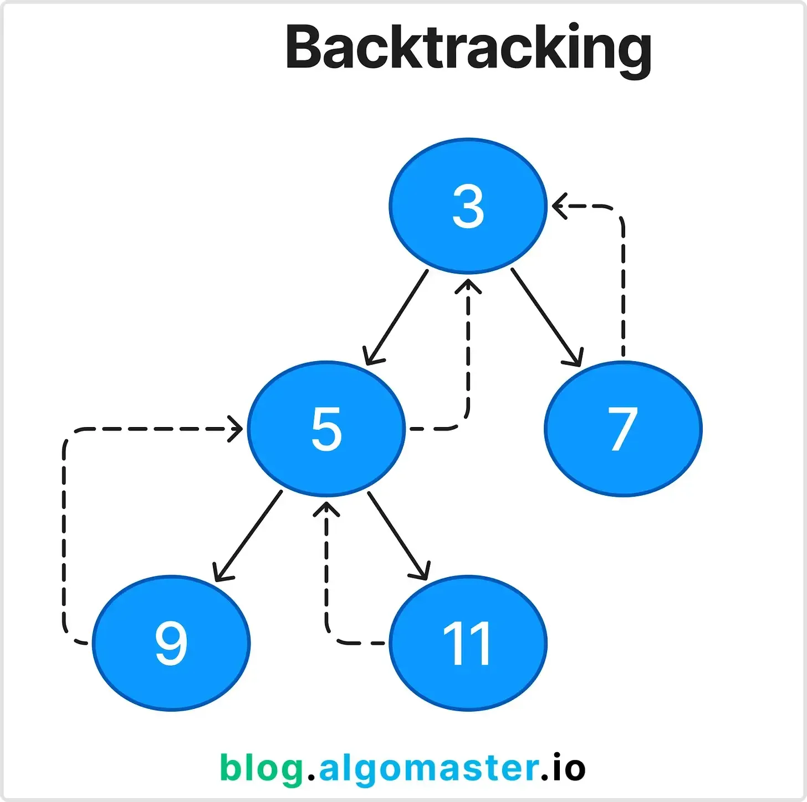

- **Sample Problem:** Generate all permutations for a given list of numbers.
  - **Input:** nums = [1, 2, 3]
  - **Output:** [[1,2,3], [1,3,2], [2,1,3], [2,3,1], [3,1,2], [3,2,1]]
- **Explanation:**
  1. Use recursion to generate permutations.
  2. For each element, include it in the current permutation and recursively generate the remaining permutations.
  3. Backtrack when all permutations for a given path are generated.
- **LeetCode Problems:**
  - [Permutations {LeetCode #46}](https://leetcode.com/problems/permutations/description/)
  - [Subsets {LeetCode #78}](https://leetcode.com/problems/subsets/description/)
  - [N-Queens {LeetCode #51}](https://leetcode.com/problems/n-queens/description/)

## 15. Dynamic Programming Patterns

- **Description of the pattern:**
  - Useful: For problems with overlapping subproblems and optimal substructure.l̥
  - Dynamic Programming (DP) involves breaking down problems into smaller subproblems and solving them using a bottom-up or top-down approach.
  - DP itself has multiple sub-patterns. [Some of the most important ones are](https://blog.algomaster.io/p/20-patterns-to-master-dynamic-programming):
    - Fibonacci Numbers
    - 0/1 Knapsack
    - Longest Common Subsequence (LCS)
    - Longest Increasing Subsequence (LIS)
    - Subset Sum
    - Matrix Chain Multiplication
  - Tip: Identify the subproblems and the recurrence relation to solve the problem efficiently.

  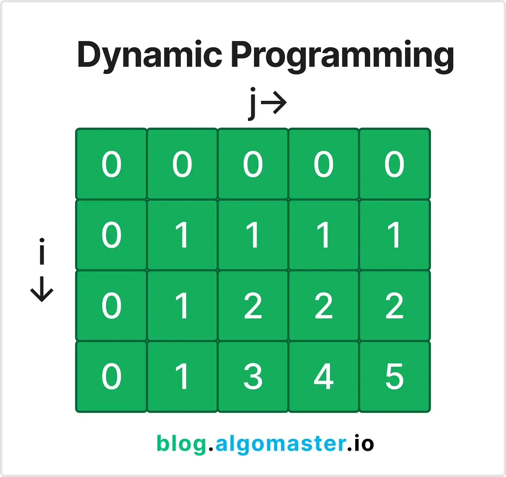

- **Sample Problem:** Calculate the n-th Fibonacci number.
  - **Input:** n = 5
  - **Output:** 5 (The first five Fibonacci numbers are 0, 1, 1, 2, 3, 5)
- **Explanation:**
  1. Use a bottom-up approach to calculate the n-th Fibonacci number.
  2. Start with the first two numbers (0 and 1) and iterate to calculate the next numbers like (dp[i] = dp[i - 1] + dp[i - 2]).
- **LeetCode Problems:**
  - [Climbing Stairs {LeetCode#70}](https://leetcode.com/problems/climbing-stairs/)
  - [House Robber {LeetCode#198}](https://leetcode.com/problems/house-robber/)
  - [Coin Change {LeetCode#322}](https://leetcode.com/problems/coin-change/)
  - [Longest Common Subsequence {LeetCode#1143}](https://leetcode.com/problems/longest-common-subsequence/)
  - [Longest Increasing Subsequence {LeetCode#300}](https://leetcode.com/problems/longest-increasing-subsequence/)
  - [Partition Equal Subset Sum {LeetCode#416}](https://leetcode.com/problems/partition-equal-subset-sum/)
  - [Minimum Path Sum {LeetCode#64}](https://leetcode.com/problems/minimum-path-sum/)
