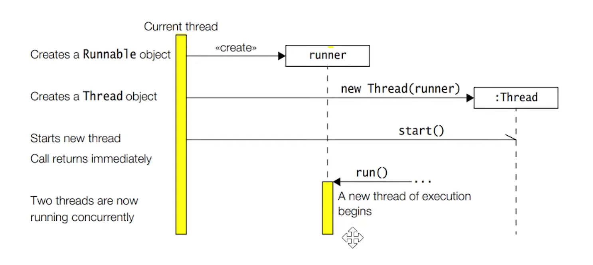
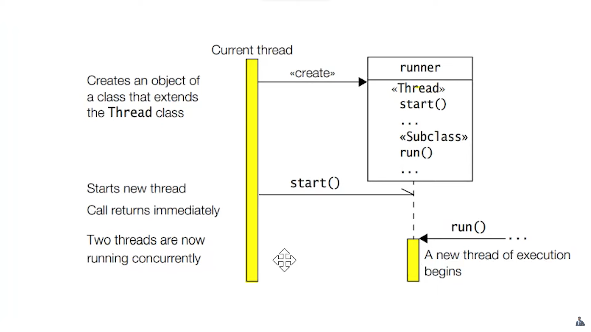
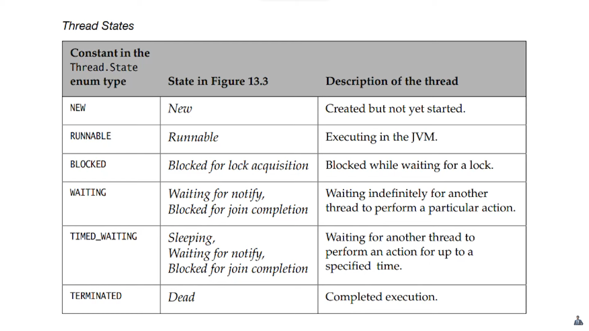
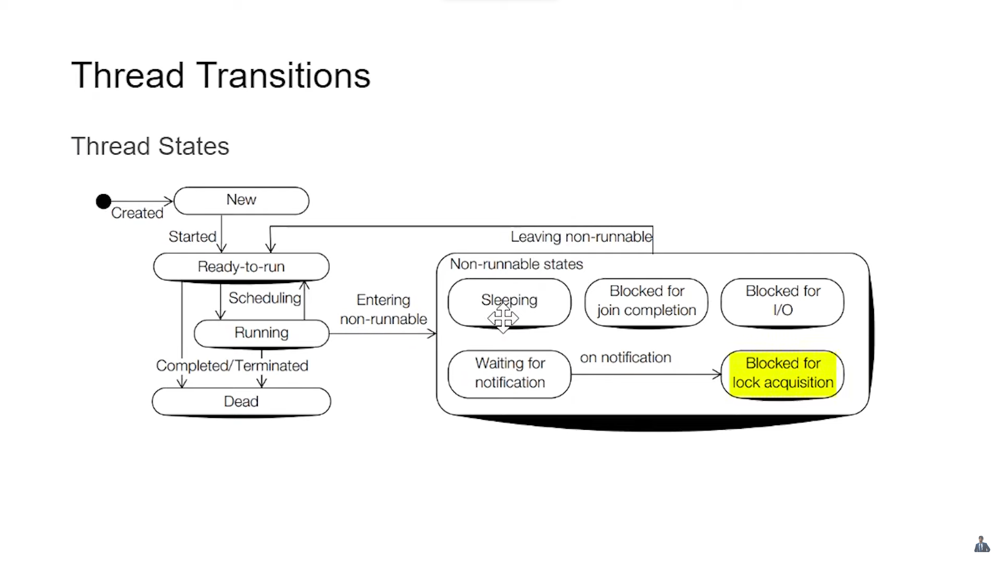

# MULTITHREADING NOTES

## Multitasking
- It Allows several activities to occur simultaneously on the computer.
- It is of two types:
    1. Process-based multitasking (Multitasking) [Allows multiple process (instances of programs) to run concurrently on the computer ]
       1. Example: Running Browser, Music Player and IntelliJ IDEA at the same time.
    2. Thread based multitasking (Multithreading) [Allows multiple parts of the same program to run concurrently on the computer]
       1. Example: Downloading a file using IDM (multiple threads downloads and assemble) or Building the project using maven using multiple threads or while using MS Word it does spell check, words count and writing in the doc.
- NOTE: This involves context switching and time slicing. For 1-core CPUs, context switching and time slicing is the only way to achieve multitasking, where as for multicore CPUs (quad-core or octa-core), we can leverage the different cores to perform real multitasking.

### Thread vs. Process
1. Two threads share the same address space, whereas two processes have different address spaces.
2. Context switching b/w the threads is usually less expensive than between processes.
3. The cost of communication b/w threads is relatively lower than between processes.

---

## Multithreading

### Why multithreading??
- To use the idle CPU time by running some other thread when one thread is waiting (for some IO operation i.e., not using the CPU).
- To improve the performance of the application by running multiple threads concurrently.
- To make the application responsive by running some threads in the background.

### What is a thread?
- A thread is an independent sequential path of execution within a program.
- Many threads can run concurrently within a process (an instance of a program).
- At runtime, threads in a program exist in a common memory space and can therefore share both data and code (i.e., they are lightweight as compared to processes).

#### Concepts in multithreading?
1. Creating threads and providing the code that gets executed by a thread.
2.  Accessing common data and code through synchronization.
3. Transitioning between thread states.

#### The Main Thread:
- When a standalone application is run, a user thread is automatically created to execute the main() method of application. This thread is called the main thread.
- If no other user thread is spawned, the program terminates when the main() method finishes executing.
- All other threads, known as the child threads, are spawned from the main thread.
- The main() method can finish, but the program will keep running until all user threads have completed.
- The runtime environment distinguishes between the user threads and the daemon threads.
- Calling the setDaemon(boolean) method in the thread class marks the status of the thread as either daemon or user, but this must be done before the thread is started.
- As long as a user thread is alive, the JVM does not terminate.
- A daemon thread is at the mercy of the runtime system: it is stopped if there are no more user threads running (including the main thread), thus terminating the program.
- When we are using aThread.start(), then it doesn't mean that the thread will run at that instant, but it is at JVM's mercy, so as soon as it is free it will run that thread.

### **Thread Creation:**
- A Thread in java is represented by the object of the thread class.
    - Creating a thread in java can be achieved by two ways:
        1. Implementing the java.lang.Runnable interface (better option).
           1. 
        2. Extending the java.lang.Thread class.
           1. 

### Different States of Threads
- 
- 

### Synchronization:
- Threads share the same memory space, i.e., they can share the resources (data and code) of the program.
- However, there are critical situations where it is desirable to that only one thread at a time has access to shared resources.

#### Synchronization Methods:
- While a thread is inside a synchronized method of an object, all other threads that wish to execute **this synchronized method** or **any other synchronized method** of the object will have to wait.
- This restriction does not apply to the thread that already has the lock and is executing a synchronized method of the object.
- Such a thread can invoke other synchronized methods of the object w/o being blocked.
- Any other thread can always call the non-synchronized methods of the object at any time.
- The synchronized methods of an object are synchronized on the object's lock (which is a lock that is associated with the object, every object has a lock).
- The thread automatically acquires the lock when it enters a synchronized method and is relinquished when the thread exits the synchronized method.

#### Locks:
- A lock is associated with every object in Java and is used to control access to the object or its methods. Useful when multiple threads are trying to access the same object.
- A thread can acquire the lock of an object by executing a synchronized method of the object. The lock is relinquished when the thread exits the synchronized method.
- Typically, a thread must acquire the lock of an object before it can enter a synchronized method of the object.
- The runtime system ensures that no other thread can enter a synchronized method of an object if another thread holds the object lock.
- Types of Locks:
    - **Object Lock:** A lock associated with an object. It can be acquired by executing a synchronized method of the object. This lock is associated with the object. Used to control access to the object or its methods.
    - **Class Lock:** A lock associated with a class. Locks of this type are acquired by executing a synchronized static method of the class. This lock is associated with the class. Used to control access to static methods of the class.
    - **Reentrant Lock:** A lock that can be acquired multiple times by the same thread w/o the thread blocking itself. This lock is associated with the thread. Used to control access to shared resources.
    - **Read Lock:** A lock that allows multiple threads to read a shared resource concurrently. `readLock()` and `unlockRead()` methods are used to acquire and release the lock.
    - **Write Lock:** A lock that allows only one thread to write to a shared resource. `writeLock()` and `unlockWrite()` methods are used to acquire and release the lock.
    - **Fair Lock:** A lock that grants access to the longest waiting thread. This lock is associated with the thread.
    - **Unfair Lock:** A lock that grants access to the thread that requests it first. This lock is associated with the thread.
    - **Stamped Lock:** A lock that supports both read and write locks. It also supports optimistic reading (reading without acquiring a lock). This lock is associated with the thread.
    - **Reentrant Read-Write Lock:** A lock that allows multiple threads to read a shared resource concurrently and only one thread to write to the shared resource. This lock is associated with the thread.

#### Rules of Synchronization:
- A thread must acquire the object lock associated with a shared resource before it can enter the shared resource.
- The runtime system ensures that no other thread can enter a shared resource if another thread holds the object lock associated with it.
- If a thread cannot immediately acquire the object lock, it is blocked, i.e., it must wait for the lock to become available.
- When a thread exists a shared resource, the runtime system ensures that the object lock is also relinquished. If another thread is waiting for this object lock, it can try to acquire the lock to gain access to the shared resource.
- It should be made clear that the programs should not make any assumptions about the order in which threads are granted ownership of a lock.

#### Static Synchronization Methods:
- A thread acquiring the lock of a class to execute a static synchronized method has no effect on any thread acquiring the lock on any object of the class to execute a synchronized instance method.
- In other words, synchronization of static methods in a class is independent of the synchronization of instance methods on objects of the class.
- A subclass decides whether the new definition of an inherited synchronized method will remain synchronized in the subclass.
- ***Race Condition:*** It occurs when two or more threads simultaneously update the same value and as a consequence, leave the value in an undefined or inconsistent state.

#### Synchronized Blocks:
- Whereas execution of synchronized methods of an object is synchronized on the lock of the object, the synchronized block allows execution of arbitrary code to be synchronized on the lock of an arbitrary object.
- The general form of the synchronized statement is as follows:
    - synchronized (object ref expression) {<code_block>}
- The object ref expression must evaluate to a non-null reference value, otherwise a NullPointerException is thrown.

### Disadvantages of Synchronization over Locks
The `synchronized` keyword (implicit lock) in Java has several disadvantages compared to explicit locks like `ReentrantLock`:
1. **Lack of Flexibility**:
    - `synchronized` blocks or methods **cannot be interrupted**, timed out, or polled for lock status. Explicit locks provide methods like `lockInterruptibly()`, `tryLock()`, and `tryLock(long time, TimeUnit unit)` for more flexible locking mechanisms.
2. **No Fairness Policy**:
    - The `synchronized` keyword does not support fairness policies. Explicit locks can be configured to be fair, ensuring that the longest-waiting thread gets the lock next.
3. **No Condition Variables**:
    - `synchronized` blocks do not support multiple condition variables. Explicit locks provide `Condition` objects, allowing more complex thread coordination.
4. **No Explicit Locking and Unlocking**:
    - With `synchronized`, locking and unlocking are implicit and tied to the scope of the block or method. Explicit locks allow more control over when to lock and unlock, which can be useful in complex scenarios.
5. **Performance Overhead**:
    - `synchronized` blocks can have higher performance overhead due to JVM optimizations and the lack of fine-grained control over locking.
6. **Deadlock Detection**:
    - Explicit locks can be used with tools and libraries that detect deadlocks, whereas `synchronized` blocks do not provide such capabilities.

#### Using `synchronized` (Implicit Lock)
```java
public class SynchronizedExample {
    private int count = 0;

    public synchronized void increment() {
        count++;
    }

    public synchronized int getCount() {
        return count;
    }
}
```

#### Using `ReentrantLock` (Explicit Lock)
```java
import java.util.concurrent.locks.Lock;
import java.util.concurrent.locks.ReentrantLock;

public class ReentrantLockExample {
    private int count = 0;
    private final Lock lock = new ReentrantLock();

    public void increment() {
        lock.lock();
        try {
            count++;
        } finally {
            lock.unlock();
        }
    }

    public int getCount() {
        lock.lock();
        try {
            return count;
        } finally {
            lock.unlock();
        }
    }
}
```

In the `ReentrantLockExample`, the explicit lock provides more control and flexibility over the locking mechanism. It allows for interruptible, timed, and polled locking, supports fairness policies, and provides condition variables for more complex thread coordination. Additionally, explicit locks can be used with tools and libraries that detect deadlocks, providing more robust synchronization mechanisms.

### Waiting and Notifying:

#### Waiting: 
  - A thread in the waiting-for-notification state can be awakened by the occurrence of any one of these 3 incidents:
  - The waiting thread times out.
  - Another thread interrupts the waiting thread (in this case, it might throw an exception once its waiting time is over).
  - Another thread invokes the notify() method on the object of the waiting thread, and the waiting thread is selected as the thread to be awakened.

#### Notify:
  - Invoking the notify() method on an object wakes up a single thread which is waiting for the lock of this object.
  - The selection of a thread to awaken is dependent on the thread policies implemented by the JVM.
  - On being notified, a waiting thread first transits to the Blocked-for-lock-acquisition state to acquire the lock on the object, and not directly to the Ready-to-run state.
  - The thread is also removed from the wait set of the object.

#### Important Methods:
  - final void wait(long timeout) throws InterruptedException
  - final void wait(long timeout, int nanos) throws InterruptedException
  - final void wait() throws InterruptedException
  - final void notify()
  - final void notifyAll()

#### Timed Out:
  - When passing timeout as an argument, in the wait() method then the thread should wait before being timed out for that time, if already it wasn't awakened by being notified.
  - The awakened thread has no way of knowing whether it was timed out or woken up by one of the notification methods.

#### Interrupted:
  - When another thread invoked the interrupt() method on the waiting thread.
  - When the awakened thread is enabled, but the return from the wait() call will result in an InterruptedException if and when the awakened thread finally gets a chance to run.
  - The coed invoking the wait() method must be prepared to handle this checked exception.

### Thread Priorities:
- Threads are assigned priorities that the thread scheduler can use to determine how the threads can be scheduled.
- Priorities are integer value from 1 (Thread.MIN_PRIORITY) to 10 (Thread.MAX_PRIORITY) and the default priority is 5 (Thread.NORM_PRIORITY).
- A thread inherits the priority of its parent thread.
- We could use the <threadName>.getPriority() and <threadName>.setPriority() as getter and setter which are predefined in Thread class.
- The setPriority() method is an advisory method, as it provides hints to the JVM for scheduling which the JVM has no obligation to honor.
    - So what do we achieve by setting the thread priority??
        - The thread scheduler **favors** giving CPU time to the thread with the highest priority in the ready-to-run state, but there is no guarantee of the same, hence heavy reliance on thread priority for the behavior of the program can lead the program unportable across platforms as thread scheduling algorithms are host platform dependent.

### Thread Scheduler:
Schedulers in JVM implementations generally employ one of the two following strategies:
####  1. Preemptive Scheduling:
In preemptive scheduling, the operating system can interrupt a running thread at any time, allowing it to efficiently manage and allocate CPU time among multiple threads. Key features include:

- **Thread Interruption:** The OS can interrupt a running thread.
- **Priority-Based:** Threads are assigned priorities for execution.
- **Efficient Resource Utilization:** Enables optimal utilization of system resources.

#### 2. Time-Sliced (Round Robin) Scheduling:

Time-sliced scheduling assigns each thread a fixed time slice or quantum during which it can execute. After the time slice expires, the scheduler moves to the next thread in a cyclic manner. Key features include:

- **Fixed Time Slices:** Threads are given fixed time for execution.
- **Cyclic Execution:** Threads execute in a circular manner.
- **Fairness:** Ensures fair distribution of CPU time.
- **Predictable Behavior:** Suitable for scenarios with real-time requirements.

#### Comparison:

| Criteria                | Preemptive Scheduling          | Time-Sliced (Round Robin) Scheduling |
|-------------------------|--------------------------------|---------------------------------------|
| **Thread Interruption**  | Can be interrupted at any time  | Switches threads at fixed time slices |
| **Priority-Based**       | Yes                            | Not solely based on priority          |
| **Resource Utilization** | Efficient resource utilization | Fair distribution of CPU time          |
| **Predictability**       | Less predictable               | More predictable                      |

#### Selection Criteria:

- **Preemptive Scheduling:**
    - Suitable for scenarios prioritizing thread priorities.
    - Efficient resource utilization is a priority.

- **Time-Sliced Scheduling:**
    - Suitable for scenarios prioritizing fairness and predictability.
    - Useful in scenarios with real-time requirements.

### Deadlocks:
- A deadlock is a situation where a thread is waiting for an object lock that another thread holds, and this other thread is waiting for an object lock that the earlier thread holds.
- Since each thread is waiting for the other thread to relinquish the lock, hence they both remain waiting forever in the blocked-for-lock-acquisition state.
- The threads are said to be deadlocked.

### Thread Safety: 
- It's the term used to describe the design of classes that ensures that the state of their object is always consistent, even when the objects are used concurrently by multiple threads. E.g., StringBuffer.

## *SUMMARY:*
- A thread can hold a lock on an object:
  - By executing a synchronized instance method of the object. (this)
  - By executing the body of a synchronized block that synchronizes on the object. (this)
  - By executing a synchronized static method of a class or a block inside a static method (in this case, the object is the Class object representing the class in the JVM)
  - Whenever a thread is sleeping, it doesn't relinquish its lock, it will only relinquish when it is waiting for a notification. 
  - Also, it only relinquishes the lock on the object on which wait method was invoked, it doesn't relinquish any other object lock that it might hold, and it will remain locked when the thread is waiting.

[//]: # (Todo: Lock Interruptibility??)